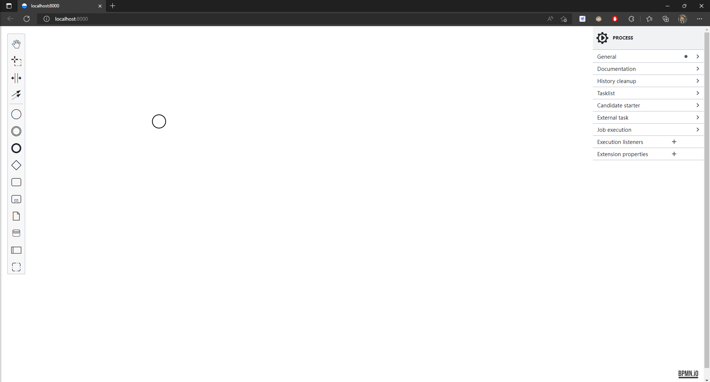

# bpmn-js-example-01


bpmn集成示例，集成官方示例。


### 安装依赖

```bash
yarn install
or
npm install
```


### 启动项目

```bash
yarn start
```


### 运行示例




### 属性面板扩展组件返回示例

从 官方示例：[bpmn-js-examples/properties-panel-extension at master · bpmn-io/bpmn-js-examples · GitHub](https://github.com/bpmn-io/bpmn-js-examples/tree/master/properties-panel-extension) 克隆下来的仓库，模仿自定义一个组件时，应使用如下方式返回。

SpellProps.js 文件中，返回值使用标签的形式，会报错。

```js
  return <TextFieldEntry
    id={ id }
    element={ element }
    description={ translate('Apply a black magic spell') }
    label={ translate('Spell') }
    getValue={ getValue }
    setValue={ setValue }
    debounce={ debounce }
  />
```

解决：返回对象

```js
  return TextFieldEntry({
    id: id,
    label: translate ? 'Spell' : '魔法值',
    element,
    description: translate ? 'Apply a black magic spell' : '施展一个黑魔法',
    getValue,
    setValue,
    debounce,
  });
```
